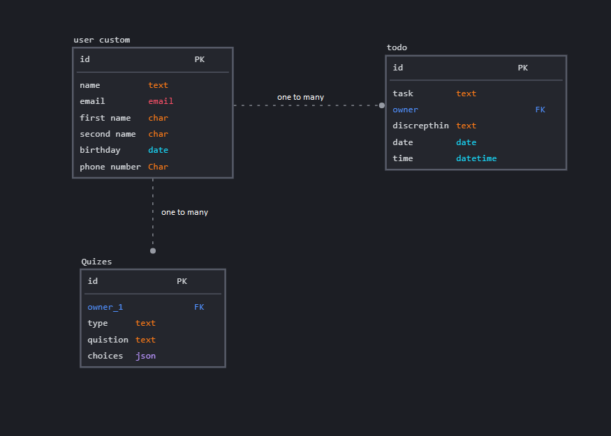

# Dhikraa_Backend Project

## Team member:
* **Walaa' Atiyh**
* **Amani M Al-Zoubi**
* **Ihab Abbas**
* **mohammad alghzawi**
* **Bashar Telfah**

## databass : elephantsql[postgresql]

## Description

The goal of this API is so that the user can communicate with the datapass and store the daily tasks ,In addition to creating a set of questions that will appear to the user randomly so that he can answer them.
The website can be help people to make his lifestyle organize with many useful activity that will improve his inner self and the out one.

## Useful Notes
The backend functionalities can be divided into 2 categories, those that serve the frontend app (NEXT js), and those used for the administration of the store (which is different from the Django Admin).

## Install (Run) with Docker

1. **Clone the repo**
2. **create  file `project/.env`
3. **add every thing in  `project/.env.sample` in `.env` file**
4. **Create the VE and activate it.**
   * `python3.10 -m venv .venv `
   * `source .venv/bin/activate`

5. **install requirements.txt**

    * `pip3 install -r requirements.txt`

6. **work with docker**
   * `docker-compose up --build`

7. if you create anew app (module) run this command in another template
   * docker-compose run web python manage.py makemigrations
  * docker-compose run web python manage.py migrate

8. **run in local**
   * `python manage.py makemigrations`
   * `python manage.py migrate`
   * `python manage.py runserver`

9.  **superuser**

    username :admin

    password:admin

## Getting Started
## 1. custom user Authentication
 

| API end-points   | HTTP Method   | Authentication  | Permission  | body                      | Result                        |
|----------------- |-------------  |------------   |------------   |-----------------------     |--------------------------     |
| api/token/       | post          | user          | user          | {"username":""  ,"password":""  }  |{access token , refresh token }
| api/accounts/register/    | POST     |   allowany    | allowany          |   {"username":""  ,"password":"",password2,email,  }   | sign up the new user |
| api/accounts/change_password/<int:pk>/      | put           | authUser          | authUser          |   {"password":""  ,"password2":"",old_password,  } & send the access token   | update the password |
| api/accounts/update_profile/<int:pk>/      | put           | authUser          | authUser          |   {"password":""  ,"password2":"",old_password,  } & send the access token   | update the user profile |
| api/accounts/users/      | get           | authUser          | authUser          |     send the access token   | get list of user   |
| api/accounts/users/ <str:username>     | get           | authUser          | authUser          |     send the access token   | get data for specific user   |

 

## 2.  Authentication and Permission for models
 

| API end-points        | HTTP Method   | Authentication  | Permission  | Result                                       |
|---------------------- |-------------  |------------   |------------  |------------------------------------------     |
| /todo                 | GET           | User          | User         | List of tasks for this user                   |
| /todo                 | POST          | User          | User         | Create new task                               |
| /todo/{todo_pk}       | GET           | User          | User         | Retrieve details of a particular task         |
| /todo/{todo_pk}       | PUT           | User          | User         | Update a particular task's info               |
| /todo/{todo_pk}       | DELETE        | User          | User         | Delete a particular task's details from DB    |
| /quiz                 | GET           | User          | User         | List of quizzes                               |
| /quiz                 | POST          | Admin         | Admin        | Create new question                           |
| /quiz/{quiz_pk}       | GET           | Admin         | Admin        | Retrieve details of a particular question     |
| /quiz/{quiz_pk}       | PUT           | Admin         | Admin        | Update a particular question's info           |
| /quiz/{quiz_pk}       | DELETE        | Admin         | Admin        | Delete a particular question's details from DB|
